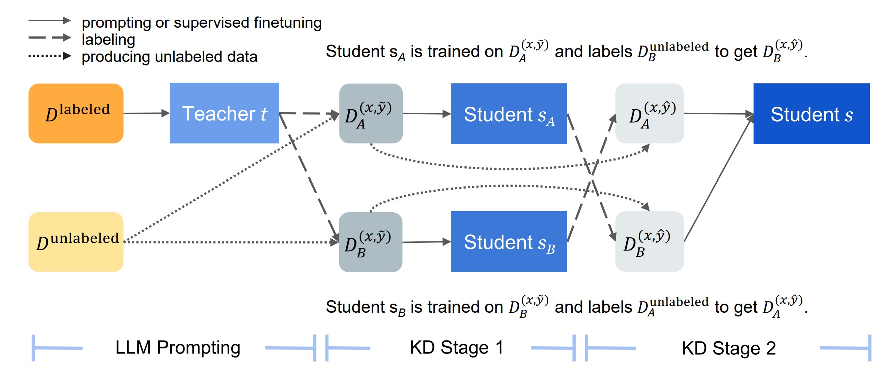

# Multistage Collaborative Knowledge Distillation on Semantic Segmentation

Final project for the **Advanced Machine Learning** course held by prof. Fabio Galasso at **Università Spienza di Roma** in A.Y. 2023/2024.

## Introduction

Semantic segmentation is a widely studied task in the field of computer vision. However, in many applications, a frequent obstacle is the lack of 
labeled images, because acquiring dense an notations of images is labor-intensive and time-consuming. In this project, we will investigate a novel
distillation approach recently proposed, Multistage Collaborative Knowledge Distillation (MCKD) (Zhao et al., 2023) [[1]](https://arxiv.org/abs/2311.08640), for semi-supervised sequence prediction. Inspired by the results obtained in the original paper, we propose to study the effectiveness of this technique on image semantic segmentation.



<i>Image from the original paper</i>

## Report
<i>Coming soon</i>

## Getting Started

### Datasets
We evaluate our approach on two public semantic segmentation benchmark datasets:
- [COCO](https://cocodataset.org/#home)
- [Cityscapes](https://www.cityscapes-dataset.com/)

### Training

After collecting pseudo-labels for a large amount of unlabeled data from a teacher, the MCKD method consists of performing multiple stages of vanilla KD. In the first one, a pair of students are trained on distinct partitions of pseudo-labeled data and produce new pseudolabels for the data that they have not been trained on. In the final distillation stage, a single student is trained on all the latest pseudo-labeled data.

[First stage](training/first_stage.py)

```python
for dataset in ["coco", "cityscapes"]:
    # Student 1
    print(f'### Starting training student1 on {dataset} dataset... ###')
    train(stud_id=1, dataset=dataset)
    print(f'### Testing student1 on {dataset} dataset... ###')
    test(stud_id=1, dataset=dataset)

    # Student 2
    print(f'### Starting training student2 on {dataset} dataset... ###')
    train(stud_id=2, dataset=dataset)
    print(f'### Testing student2 on {dataset} dataset... ###')
    test(stud_id=2, dataset=dataset)
```

[Final stage](training/final_stage.py)

```python
for dataset in ["coco", "cityscapes"]:
    # Final student
    print(f'### Starting training the final student on {dataset} dataset... ###')
    final_train(dataset=dataset)
    print(f'### Testing the final student on {dataset} dataset... ###')
    test(dataset=dataset)
```

### Demo

We propose a [simple notebook demo](demo/demo.ipynb) to perform inference using our two final NN models for semantic segmentation.
Notice that to run it you need the two checkpoints models saved locally. Create in the src folder the following
paths:

    ├── ... 
    ├── checkpoints                    
    │   ├── coco                
    │   │   └── final_student_ckpt.pth      # Saved model checkpoint on COCO
    │   └── cityscapes          
    │       └── final_student_ckpt.pth      # Saved model checkpoint on Cityscapes
    └── ...


## References

<a id="1">[1]</a> 
Zhao, Jiachen, et al. "Multistage Collaborative Knowledge Distillation from Large Language Models." arXiv preprint arXiv:2311.08640 (2023).

## Group members

- [Chiara Ballanti](https://github.com/Ballants)
- [Sophia Balestrucci](https://github.com/sophiaBalestrucci)
- [Paolo Pio Bevilacqua](https://github.com/ppbevilacqua)
- [Ilaria Gagliardi](https://github.com/ilaria-gagliardi)